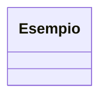

## Esercizio UML

### Obiettivo

Si desidera modellare un sistema di gestione di una biblioteca. Il sistema deve includere le seguenti classi:

### Istruzioni

Creare solo il diagramma UML delle classi utilizzando la sintassi di MermaidJS, per ora non ci sono i metodi.
Consegnare un file markdown con il diagramma UML in un blocco mermaid.

Esempio di blocco mermaid:

1. **Autore**:
   - Ogni autore ha un nome e un cognome.
   - Ogni autore scrive una biografia. Ogni biografia è scritta da un solo autore.
   - Ogni autore può scrivere uno o più libri. Ogni libro è scritto da un solo autore.

2. **Biografia**:
   - Ogni biografia contiene un testo e una data di pubblicazione.

3. **Biblioteca**:
   - Ogni biblioteca ha un nome e un indirizzo.
   - Ogni biblioteca contiene uno o più libri.
   - Ogni biblioteca serve uno o più studenti.

4. **Libro**:
   - Ogni libro ha un titolo e un autore.
   - Ogni libro può essere preso in prestito da uno o più studenti, e ogni studente può prendere in prestito uno o più libri.

5. **Studente**:
   - Ogni studente ha un nome e un cognome.
   - Ogni studente può prendere in prestito uno o più libri.
   - Ogni studente possiede un dispositivo.

6. **Dispositivo**:
   - Ogni dispositivo ha una marca e un modello.
   - Esistono due tipi di dispositivi: smartphone e tablet.
   - Uno smartphone ha un attributo booleano che indica se supporta il 5G.
   - Un tablet ha un attributo booleano che indica se ha una penna.
