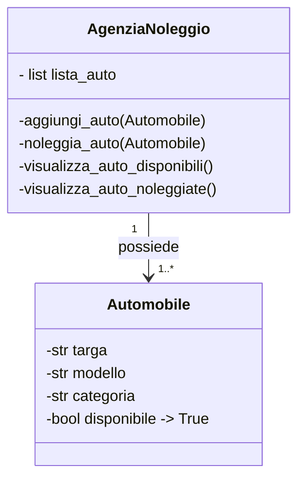

```mermaid
    classDiagram
class Automobile {
    -str targa
    -str modello
    -str categoria
    -bool disponibile -> True
}

class AgenziaNoleggio {
    - list lista_auto
    -aggiungi_auto(Automobile)
    -noleggia_auto(Automobile)
    -visualizza_auto_disponibili()
    -visualizza_auto_noleggiate()
}
AgenziaNoleggio "1" --> "1..*" Automobile :possiede

```