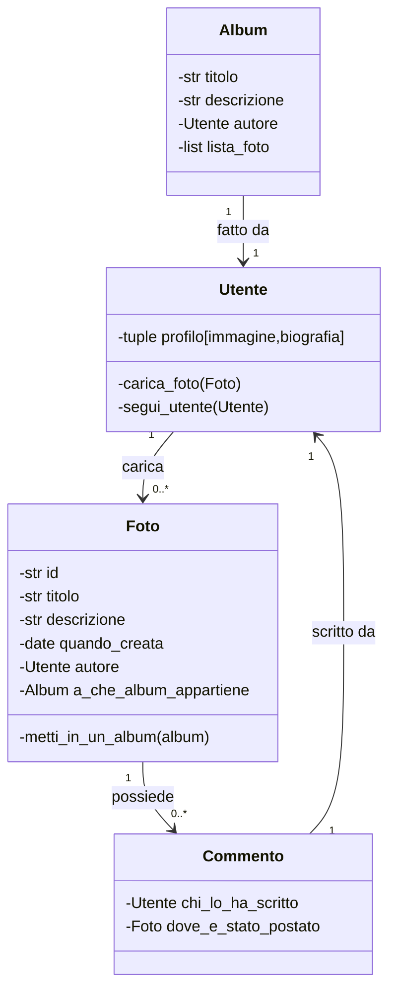

```mermaid
    classDiagram

    class Utente {
    -tuple profilo[immagine,biografia]
    -carica_foto(Foto)
    -segui_utente(Utente)
    }
    class Foto {
    -str id
    -str titolo
    -str descrizione
    -date quando_creata
    -Utente autore
    -Album a_che_album_appartiene
    -metti_in_un_album(album)
    }
    class Album {
    -str titolo
    -str descrizione
    -Utente autore
    -list lista_foto
    }
    class Commento {
    -Utente chi_lo_ha_scritto
    -Foto dove_e_stato_postato
    }

    Utente "1" --> "0..*" Foto :carica
    Foto "1" --> "0..*" Commento :possiede
    Commento "1" --> "1" Utente :scritto da
    Album "1" --> "1" Utente :fatto da
```