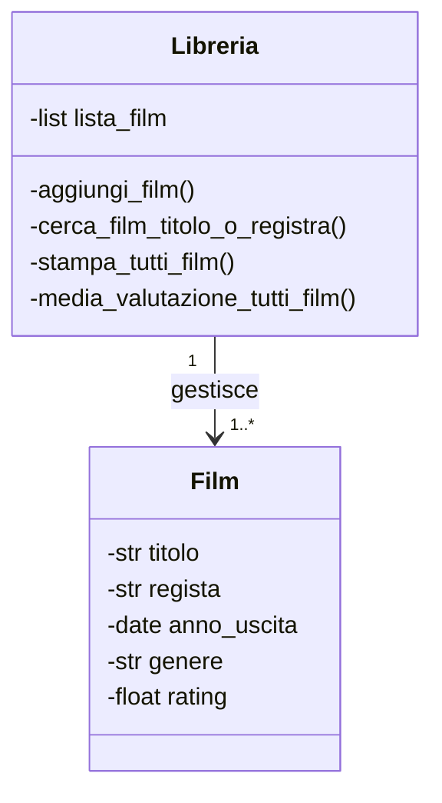

```mermaid
    classDiagram

    class Libreria {
    -list lista_film
    -aggiungi_film()
    -cerca_film_titolo_o_registra()
    -stampa_tutti_film()
    -media_valutazione_tutti_film()

    }
    class Film {
    -str titolo
    -str regista
    -date anno_uscita
    -str genere
    -float rating
    }
    Libreria "1" --> "1..*" Film :gestisce
```