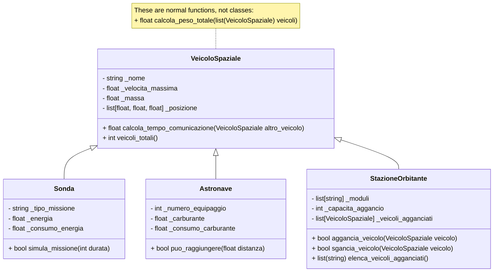

```mermaid
classDiagram
    class VeicoloSpaziale {
        - string _nome
        - float _velocita_massima
        - float _massa
        - list[float, float, float] _posizione

        + float calcola_tempo_comunicazione(VeicoloSpaziale altro_veicolo)
        + int veicoli_totali()
    }

    class Sonda {
        - string _tipo_missione
        - float _energia
        - float _consumo_energia

        + bool simula_missione(int durata)
    }

    class Astronave {
        - int _numero_equipaggio
        - float _carburante
        - float _consumo_carburante

        + bool puo_raggiungere(float distanza)
    }

    class StazioneOrbitante {
        - list[string] _moduli
        - int _capacita_aggancio
        - list[VeicoloSpaziale] _veicoli_agganciati

        + bool aggancia_veicolo(VeicoloSpaziale veicolo)
        + bool sgancia_veicolo(VeicoloSpaziale veicolo)
        + list(string) elenca_veicoli_agganciati()
    }

    note for VeicoloSpaziale "These are normal functions, not classes:
    + float calcola_peso_totale(list(VeicoloSpaziale) veicoli)"

    VeicoloSpaziale <|-- Sonda
    VeicoloSpaziale <|-- Astronave
    VeicoloSpaziale <|-- StazioneOrbitante
```
