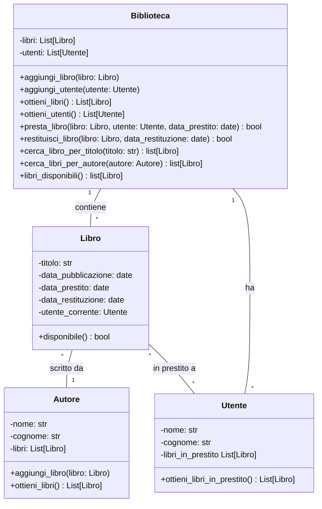

```mermaid
classDiagram
    class Libro {
        -titolo: str
        -data_pubblicazione: date
        -data_prestito: date
        -data_restituzione: date
        -utente_corrente: Utente
        +disponibile() bool
    }

    class Autore {
        -nome: str
        -cognome: str
        -libri: List[Libro]
        +aggiungi_libro(libro: Libro)
        +ottieni_libri() List[Libro]
    }

    class Utente {
        -nome: str
        -cognome: str
        -libri_in_prestito List[Libro]
        +ottieni_libri_in_prestito() List[Libro]
    }

    class Biblioteca {
        -libri: List[Libro]
        -utenti: List[Utente]
        +aggiungi_libro(libro: Libro)
        +aggiungi_utente(utente: Utente)
        +ottieni_libri() List[Libro]
        +ottieni_utenti() List[Utente]
        +presta_libro(libro: Libro, utente: Utente, data_prestito: date) bool
        +restituisci_libro(libro: Libro, data_restituzione: date) bool
        +cerca_libro_per_titolo(titolo: str) list[Libro]
        +cerca_libri_per_autore(autore: Autore) list[Libro]
        +libri_disponibili() list[Libro]
    }

    Libro "*" -- "1" Autore : scritto da
    Libro "*" -- "*" Utente : in prestito a
    Biblioteca "1" -- "*" Libro : contiene
    Biblioteca "1" -- "*" Utente : ha
```
