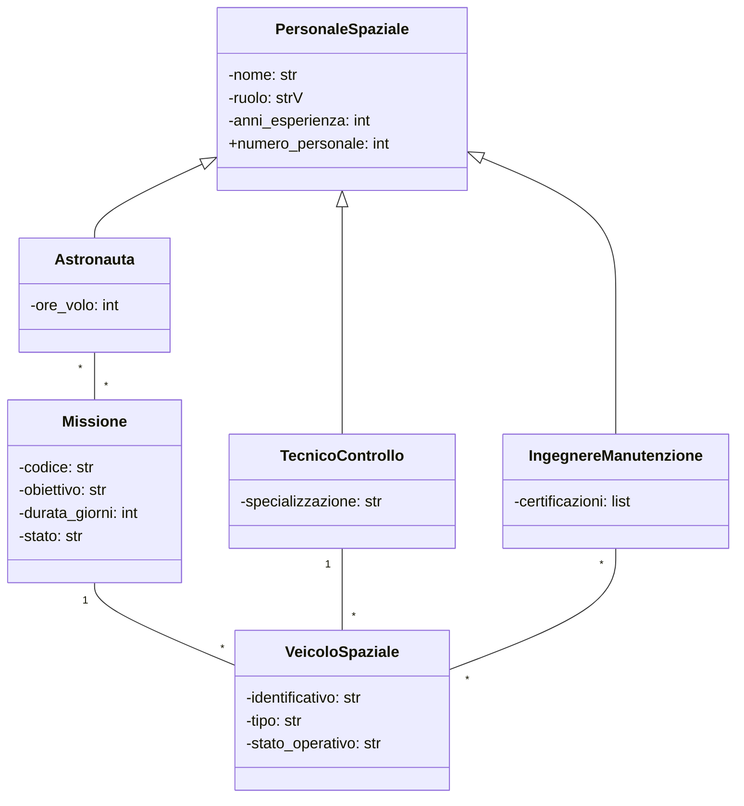

```mermaid
classDiagram

class PersonaleSpaziale {
-nome: str
-ruolo: strV
-anni_esperienza: int
+numero_personale: int
}

class Astronauta {
-ore_volo: int
}

class TecnicoControllo {
-specializzazione: str
}

class IngegnereManutenzione {
-certificazioni: list
}

class Missione {
-codice: str
-obiettivo: str
-durata_giorni: int
-stato: str
}

class VeicoloSpaziale {
-identificativo: str
-tipo: str
-stato_operativo: str
}

PersonaleSpaziale <|-- Astronauta
PersonaleSpaziale <|-- TecnicoControllo
PersonaleSpaziale <|-- IngegnereManutenzione

Missione "1" -- "*" VeicoloSpaziale
TecnicoControllo "1" -- "*" VeicoloSpaziale
IngegnereManutenzione "*" -- "*" VeicoloSpaziale
Astronauta "*" -- "*" Missione
```
