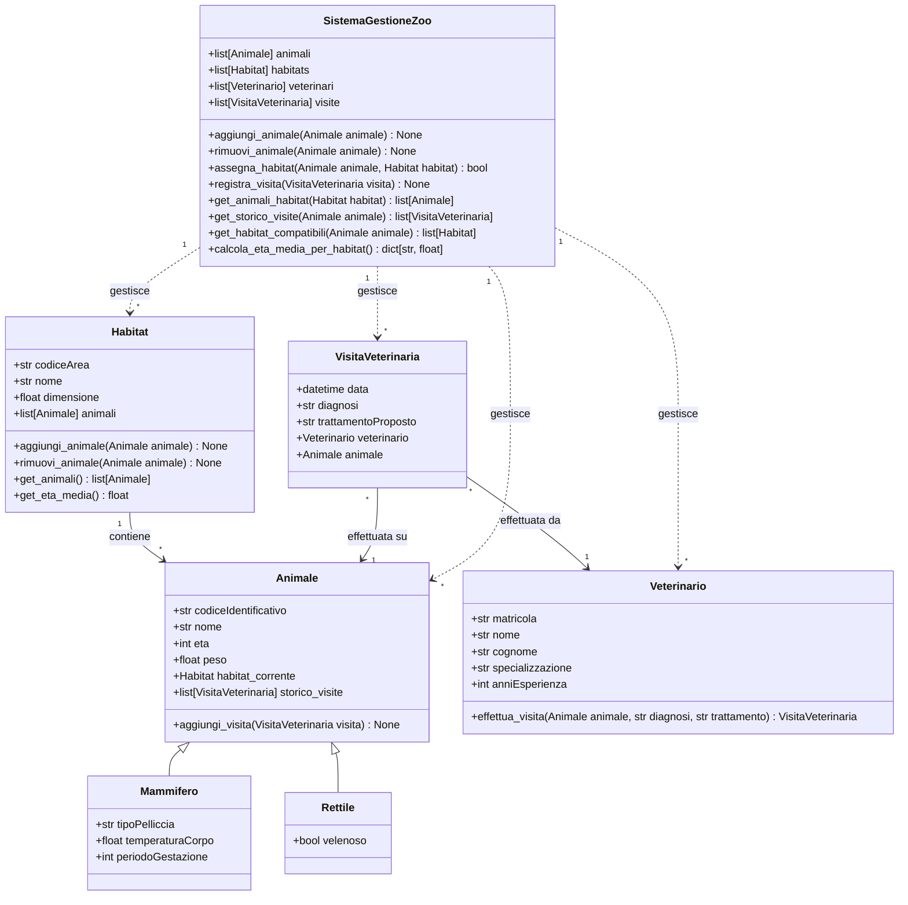

# Diagramma UML del Sistema Gestione Zoo

```mermaid
classDiagram
    Animale <|-- Mammifero
    Animale <|-- Rettile
    Habitat "1" --> "*" Animale : contiene
    VisitaVeterinaria "*" --> "1" Veterinario : effettuata da
    VisitaVeterinaria "*" --> "1" Animale : effettuata su
    SistemaGestioneZoo "1" ..> "*" Animale : gestisce
    SistemaGestioneZoo "1" ..> "*" Habitat : gestisce
    SistemaGestioneZoo "1" ..> "*" Veterinario : gestisce
    SistemaGestioneZoo "1" ..> "*" VisitaVeterinaria : gestisce

    class Animale {
        +str codiceIdentificativo
        +str nome
        +int eta
        +float peso
        +Habitat habitat_corrente
        +list[VisitaVeterinaria] storico_visite
        +aggiungi_visita(VisitaVeterinaria visita) None
    }

    class Mammifero {
        +str tipoPelliccia
        +float temperaturaCorpo
        +int periodoGestazione
    }

    class Rettile {
        +bool velenoso
    }

    class Habitat {
        +str codiceArea
        +str nome
        +float dimensione
        +list[Animale] animali
        +aggiungi_animale(Animale animale) None
        +rimuovi_animale(Animale animale) None
        +get_animali() list[Animale]
        +get_eta_media() float
    }

    class Veterinario {
        +str matricola
        +str nome
        +str cognome
        +str specializzazione
        +int anniEsperienza
        +effettua_visita(Animale animale, str diagnosi, str trattamento) VisitaVeterinaria
    }

    class VisitaVeterinaria {
        +datetime data
        +str diagnosi
        +str trattamentoProposto
        +Veterinario veterinario
        +Animale animale
    }

    class SistemaGestioneZoo {
        +list[Animale] animali
        +list[Habitat] habitats
        +list[Veterinario] veterinari
        +list[VisitaVeterinaria] visite
        +aggiungi_animale(Animale animale) None
        +rimuovi_animale(Animale animale) None
        +assegna_habitat(Animale animale, Habitat habitat) bool
        +registra_visita(VisitaVeterinaria visita) None
        +get_animali_habitat(Habitat habitat) list[Animale]
        +get_storico_visite(Animale animale) list[VisitaVeterinaria]
        +get_habitat_compatibili(Animale animale) list[Habitat]
        +calcola_eta_media_per_habitat() dict[str, float]
    }
```
