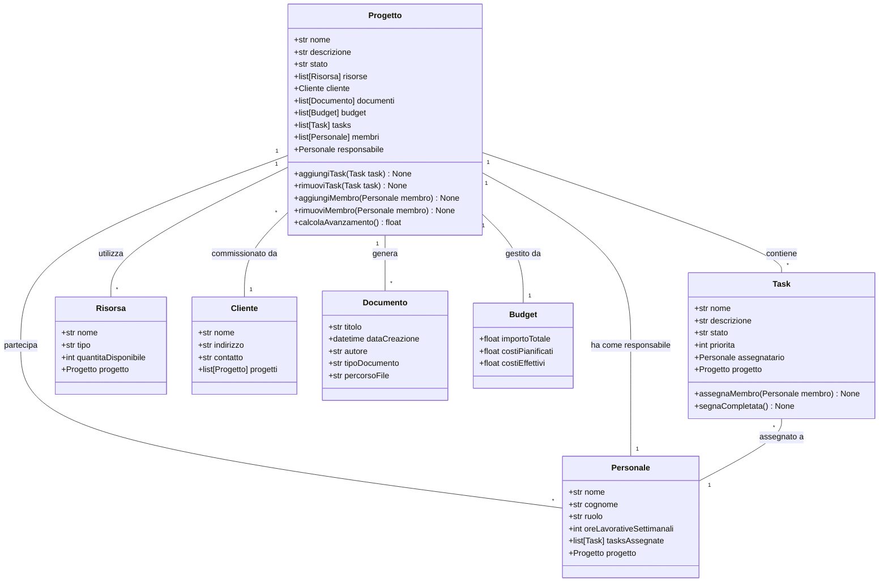

```mermaid
classDiagram
    class Progetto {
        +str nome
        +str descrizione
        +str stato
        +list[Risorsa] risorse
        +Cliente cliente
        +list[Documento] documenti
        +list[Budget] budget
        +list[Task] tasks
        +list[Personale] membri
        +Personale responsabile
        +aggiungiTask(Task task) None
        +rimuoviTask(Task task) None
        +aggiungiMembro(Personale membro) None
        +rimuoviMembro(Personale membro) None
        +calcolaAvanzamento() float
    }

    class Task {
        +str nome
        +str descrizione
        +str stato
        +int priorita
        +Personale assegnatario
        +Progetto progetto
        +assegnaMembro(Personale membro) None
        +segnaCompletata() None
    }

    class Personale {
        +str nome
        +str cognome
        +str ruolo
        +int oreLavorativeSettimanali
        +list[Task] tasksAssegnate
        +Progetto progetto
    }

    class Risorsa {
        +str nome
        +str tipo
        +int quantitaDisponibile
        +Progetto progetto
    }

    class Cliente {
        +str nome
        +str indirizzo
        +str contatto
        +list[Progetto] progetti
    }

    class Documento {
        +str titolo
        +datetime dataCreazione
        +str autore
        +str tipoDocumento
        +str percorsoFile
    }

    class Budget {
        +float importoTotale
        +float costiPianificati
        +float costiEffettivi
    }

    Progetto "1" -- "*" Task : contiene
    Progetto "1" -- "*" Personale : partecipa
    Progetto "1" -- "1" Personale : ha come responsabile
    Progetto "1" -- "*" Risorsa : utilizza
    Task "*" -- "1" Personale : assegnato a
    Progetto "*" -- "1" Cliente : commissionato da
    Progetto "1" -- "*" Documento : genera
    Progetto "1" -- "1" Budget : gestito da

```
