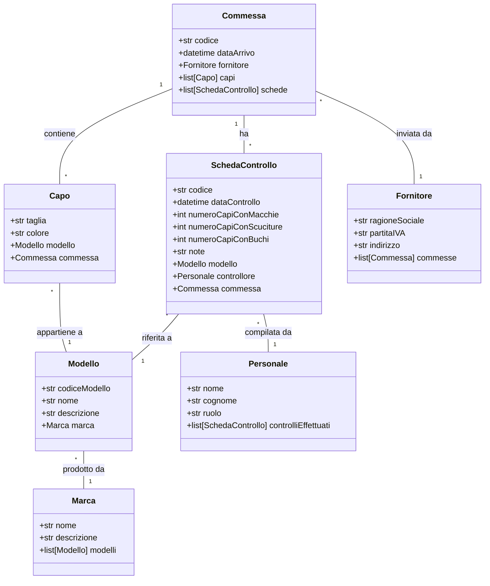

```mermaid
classDiagram
    class Commessa {
        +str codice
        +datetime dataArrivo
        +Fornitore fornitore
        +list[Capo] capi
        +list[SchedaControllo] schede
    }

    class Capo {
        +str taglia
        +str colore
        +Modello modello
        +Commessa commessa
    }

    class Modello {
        +str codiceModello
        +str nome
        +str descrizione
        +Marca marca
    }

    class Marca {
        +str nome
        +str descrizione
        +list[Modello] modelli
    }

    class SchedaControllo {
        +str codice
        +datetime dataControllo
        +int numeroCapiConMacchie
        +int numeroCapiConScuciture
        +int numeroCapiConBuchi
        +str note
        +Modello modello
        +Personale controllore
        +Commessa commessa
    }

    class Personale {
        +str nome
        +str cognome
        +str ruolo
        +list[SchedaControllo] controlliEffettuati
    }

    class Fornitore {
        +str ragioneSociale
        +str partitaIVA
        +str indirizzo
        +list[Commessa] commesse
    }

    Commessa "1" -- "*" Capo : contiene
    Commessa "1" -- "*" SchedaControllo : ha
    Capo "*" -- "1" Modello : appartiene a
    Modello "*" -- "1" Marca : prodotto da
    SchedaControllo "*" -- "1" Modello : riferita a
    SchedaControllo "*" -- "1" Personale : compilata da
    Commessa "*" -- "1" Fornitore : inviata da
```
