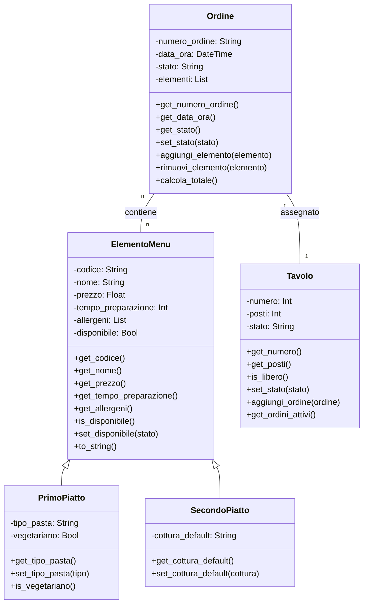

```mermaid
classDiagram

ElementoMenu  <|-- PrimoPiatto
ElementoMenu  <|-- SecondoPiatto
Ordine "n" -- "n" ElementoMenu : contiene
Ordine "n" -- "1" Tavolo : assegnato

class ElementoMenu{
    -codice: String
    -nome: String
    -prezzo: Float
    -tempo_preparazione: Int
    -allergeni: List
    -disponibile: Bool
    +get_codice()
    +get_nome()
    +get_prezzo()
    +get_tempo_preparazione()
    +get_allergeni()
    +is_disponibile()
    +set_disponibile(stato)
    +to_string()
}

class PrimoPiatto{
    -tipo_pasta: String
    -vegetariano: Bool
    +get_tipo_pasta()
    +set_tipo_pasta(tipo)
    +is_vegetariano()
}

class SecondoPiatto{
    -cottura_default: String
    +get_cottura_default()
    +set_cottura_default(cottura)
}

class Ordine{
    -numero_ordine: String
    -data_ora: DateTime
    -stato: String
    -elementi: List
    +get_numero_ordine()
    +get_data_ora()
    +get_stato()
    +set_stato(stato)
    +aggiungi_elemento(elemento)
    +rimuovi_elemento(elemento)
    +calcola_totale()
}

class Tavolo{
    -numero: Int
    -posti: Int
    -stato: String
    +get_numero()
    +get_posti()
    +is_libero()
    +set_stato(stato)
    +aggiungi_ordine(ordine)
    +get_ordini_attivi()
}
```
