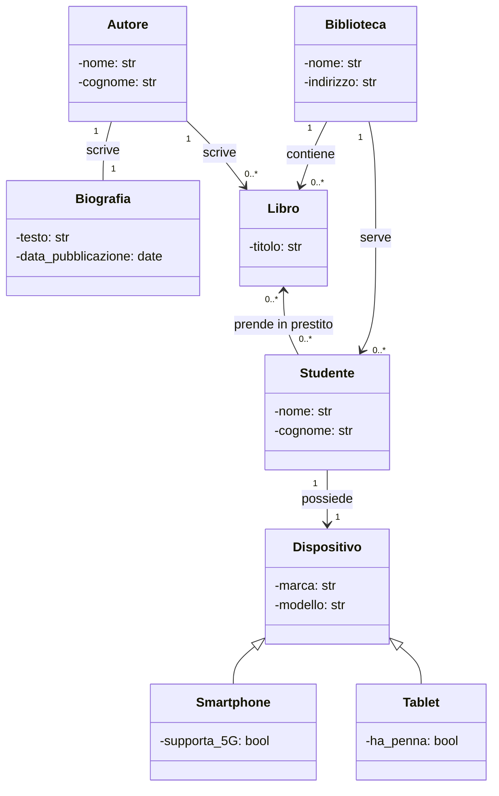

```mermaid
classDiagram
    class Autore {
        -nome: str
        -cognome: str
    }
    class Biografia {
        -testo: str
        -data_pubblicazione: date
    }
    class Biblioteca {
        -nome: str
        -indirizzo: str
    }
    class Libro {
        -titolo: str
    }
    class Studente {
        -nome: str
        -cognome: str
    }
    class Dispositivo {
        -marca: str
        -modello: str
    }
    class Smartphone {
        -supporta_5G: bool
    }
    class Tablet {
        -ha_penna: bool
    }

    Autore "1" -- "1" Biografia : scrive
    Autore "1" --> "0..*" Libro : scrive
    Biblioteca "1" --> "0..*" Libro : contiene
    Biblioteca "1" --> "0..*" Studente : serve
    Libro "0..*" <-- "0..*" Studente : prende in prestito
    Studente "1" --> "1" Dispositivo : possiede
    Dispositivo <|-- Smartphone
    Dispositivo <|-- Tablet
```
