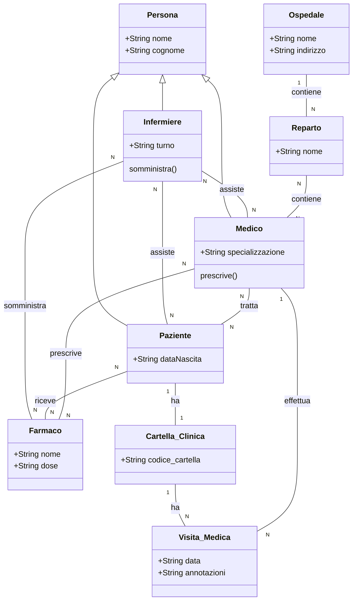

```mermaid
classDiagram
    class Ospedale {
        +String nome
        +String indirizzo
    }

    class Reparto {
        +String nome
    }

    class Persona {
        +String nome
        +String cognome
    }

    class Medico {
        +String specializzazione
        prescrive()
    }

    class Paziente {
        +String dataNascita
    }

    class Farmaco {
        +String nome
        +String dose
    }

    class Visita_Medica {
        +String data
        +String annotazioni
    }

    class Cartella_Clinica {
        +String codice_cartella
    }

    class Infermiere {
        +String turno
        somministra()
    }

    Ospedale "1" -- "N" Reparto : contiene
    Reparto "N" -- "N" Medico : contiene
    Medico "N" -- "N" Paziente : tratta
    Medico "N" -- "N" Farmaco : prescrive
    Paziente "N" -- "N" Farmaco : riceve    
    Medico "1" -- "N" Visita_Medica : effettua    
    Paziente "1" -- "1" Cartella_Clinica : ha    
    Cartella_Clinica "1" -- "N" Visita_Medica : ha    
    Infermiere "N" -- "N" Paziente : assiste        
    Infermiere "N" -- "N" Medico : assiste        
    Infermiere "N" -- "N" Farmaco : somministra

    Persona <|-- Medico
    Persona <|-- Paziente
    Persona <|-- Infermiere
```