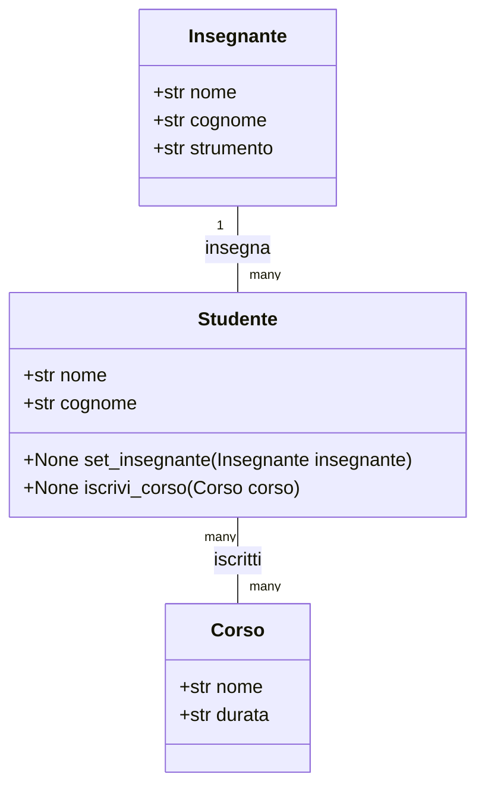

```mermaid
classDiagram
    class Insegnante {
        +str nome
        +str cognome
        +str strumento
    }

    class Studente {
        +str nome
        +str cognome
        +None set_insegnante(Insegnante insegnante)
        +None iscrivi_corso(Corso corso)
    }

    class Corso {
        +str nome
        +str durata
    }

    Insegnante "1" -- "many" Studente : insegna
    Studente "many" -- "many" Corso : iscritti
```
