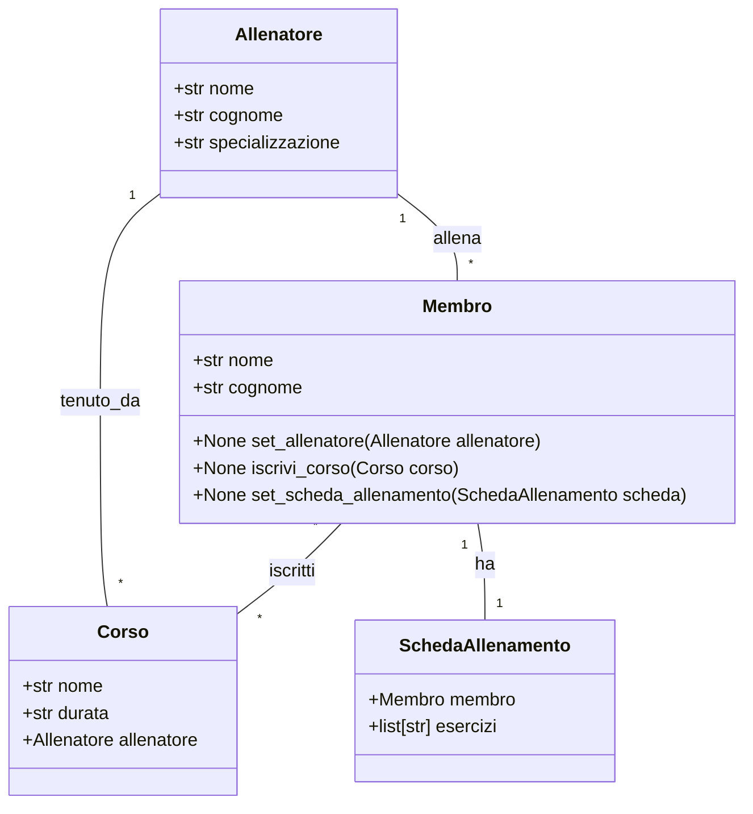

```mermaid
classDiagram
    class Allenatore {
        +str nome
        +str cognome
        +str specializzazione
    }

    class Membro {
        +str nome
        +str cognome
        +None set_allenatore(Allenatore allenatore)
        +None iscrivi_corso(Corso corso)
        +None set_scheda_allenamento(SchedaAllenamento scheda)
    }

    class Corso {
        +str nome
        +str durata
        +Allenatore allenatore
    }

    class SchedaAllenamento {
        +Membro membro
        +list[str] esercizi
    }

    Allenatore "1" -- "*" Membro : allena
    Membro "*" -- "*" Corso : iscritti
    Corso "*" -- "1" Allenatore : tenuto_da
    Membro "1" -- "1" SchedaAllenamento : ha
```
