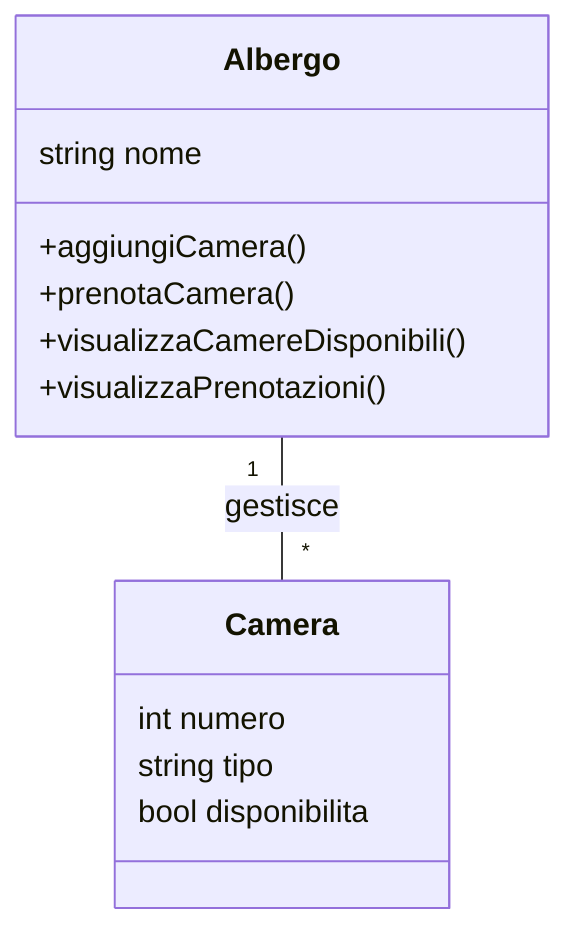
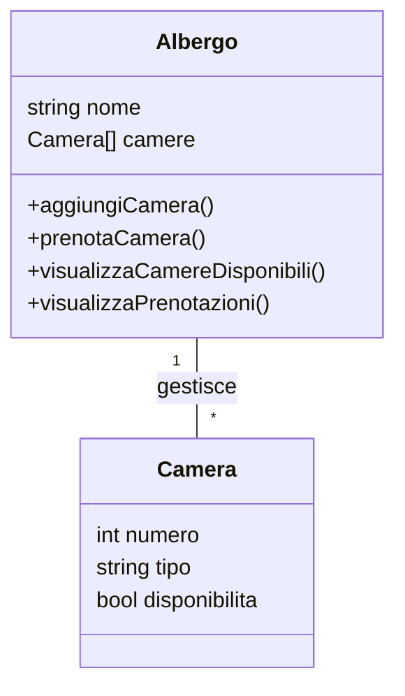

## Soluzione

### 1. Testo

Il sistema permette di gestire le prenotazioni in un albergo. L'albergo ha diverse camere, e ogni camera ha un numero, un tipo (singola, doppia, suite) e una disponibilità (occupata o libera). Il sistema deve permettere di:

- Aggiungere nuove camere all'albergo.
- Prenotare una camera (verificando se è disponibile).
- Visualizzare le camere disponibili.
- Visualizzare le prenotazioni effettuate.

Il sistema deve includere due classi principali:

1. Camera: rappresenta una singola camera dell'albergo.
2. Albergo: rappresenta l'albergo che gestisce le camere e le prenotazioni.

### 2. Analisi dello scenario

Considerazioni su classi, attributi e associazioni:

- Classe `Camera`:
  - Attributi: `numero`, `tipo`, `disponibilità`
- Classe `Albergo`:
  - Attributi: `nome`
- Associazioni: `gestisce` (relazione con `Camera`)

### 3. Primo diagramma UML - Associazioni pure



### 3.1 Considerazioni sulle associazioni

Per implementare l'associazione "gestisce" tra Albergo e Camera abbiamo tre possibilità:

1. Riferimento unidirezionale Albergo → Camera (scelta implementata):

   - Pro: L'albergo ha il controllo completo delle camere
   - Pro: Più naturale semanticamente (l'albergo gestisce le camere)
   - Pro: Più semplice implementazione delle operazioni richieste

2. Riferimento unidirezionale Camera → Albergo:

   - Contro: Difficile gestire le operazioni richieste
   - Contro: Meno naturale semanticamente
   - Pro: Ogni camera conosce il suo albergo

3. Riferimento bidirezionale:
   - Pro: Massima flessibilità
   - Contro: Maggiore complessità di gestione
   - Contro: Rischio di inconsistenza dei dati

La scelta implementativa più appropriata è la prima opzione, che viene poi realizzata nel secondo diagramma tramite l'attributo camere[].

### 4. Secondo diagramma UML

Le associazioni vengono scomposte in attributi delle classi:



### 5. Codice Python sintetico con il core dell'esercizio

```python
class Camera:
    def __init__(self, numero, tipo, disponibilita=True):
        self.numero = numero
        self.tipo = tipo
        self.disponibilita = disponibilita

class Albergo:
    def __init__(self, nome):
        self.nome = nome
        self.camere = []

    def aggiungiCamera(self, camera):
        self.camere.append(camera)

    def prenotaCamera(self, numero):
        for camera in self.camere:
            if camera.numero == numero and camera.disponibilita:
                camera.disponibilita = False
                return True
        return False

    def visualizzaCamereDisponibili(self):
        return [camera for camera in self.camere if camera.disponibilita]

    def visualizzaPrenotazioni(self):
        return [camera for camera in self.camere if not camera.disponibilita]
```
