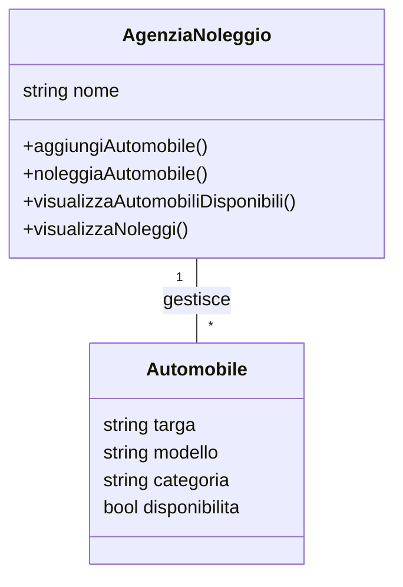
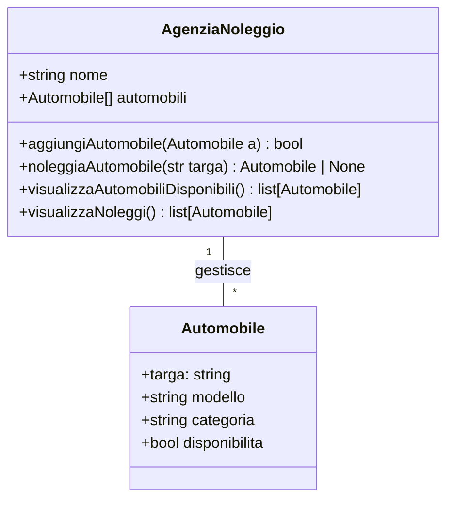
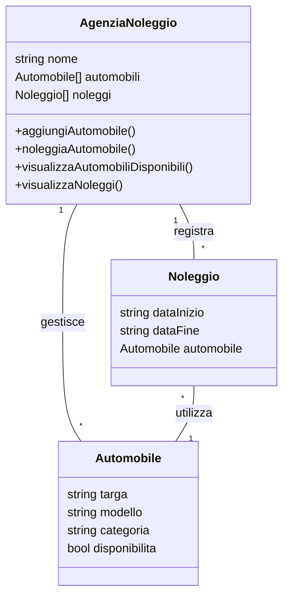

## Soluzione Esercizio 22

### 1. Testo

Il sistema permette di gestire il noleggio di automobili presso un'agenzia di autonoleggio. L'agenzia dispone di diverse automobili, e ogni automobile ha un numero di targa, un modello, una categoria (economica, media, lusso) e una disponibilità (noleggiata o disponibile). Il sistema deve permettere di:

1. Aggiungere nuove automobili all'agenzia.
2. Noleggiare un'auto (verificando se è disponibile).
3. Visualizzare le automobili disponibili.
4. Visualizzare i noleggi effettuati.

Il sistema deve includere due classi principali:
- Automobile: rappresenta una singola auto disponibile presso l'agenzia.
- AgenziaNoleggio: gestisce le automobili e i noleggi.

### 2. Analisi dello scenario

Considerazioni su classi, attributi e associazioni:

- Classe `Automobile`:
  - Attributi: `targa`, `modello`, `categoria`, `disponibilita`
- Classe `AgenziaNoleggio`:
  - Attributi: `nome`
- Associazioni: `gestisce` (relazione con `Automobile`)

### 3. Primo diagramma UML - Associazioni pure



### 3.1 Considerazioni sulle associazioni

Per implementare l'associazione "gestisce" tra AgenziaNoleggio e Automobile abbiamo tre possibilità:

1. Riferimento unidirezionale AgenziaNoleggio → Automobile (scelta implementata):

   - Pro: L'agenzia ha il controllo completo delle automobili
   - Pro: Più naturale semanticamente (l'agenzia gestisce le automobili)
   - Pro: Più semplice implementazione delle operazioni richieste

2. Riferimento unidirezionale Automobile → AgenziaNoleggio:

   - Contro: Difficile gestire le operazioni richieste
   - Contro: Meno naturale semanticamente
   - Pro: Ogni automobile conosce la sua agenzia

3. Riferimento bidirezionale:
   - Pro: Massima flessibilità
   - Contro: Maggiore complessità di gestione
   - Contro: Rischio di inconsistenza dei dati

La scelta implementativa più appropriata è la prima opzione, che viene poi realizzata nel secondo diagramma tramite l'attributo automobili[].

### 4. Secondo diagramma UML

Le associazioni vengono scomposte in attributi delle classi:



### 5. Codice Python sintetico con il core dell'esercizio

```python
class Automobile:
    def __init__(self, targa, modello, categoria, disponibilita=True):
        self.targa = targa
        self.modello = modello
        self.categoria = categoria
        self.disponibilita = disponibilita

class AgenziaNoleggio:
    def __init__(self, nome):
        self.nome = nome
        self.automobili = []

    def aggiungiAutomobile(self, automobile):
        self.automobili.append(automobile)

    def noleggiaAutomobile(self, targa):
        for automobile in self.automobili:
            if automobile.targa == targa and automobile.disponibilita:
                automobile.disponibilita = False
                return True
        return False

    def visualizzaAutomobiliDisponibili(self):
        return [automobile for automobile in self.automobili if automobile.disponibilita]

    def visualizzaNoleggi(self):
        return [automobile for automobile in self.automobili if not automobile.disponibilita]
```

### Variante del diagramma UML con gestione delle date di noleggio

