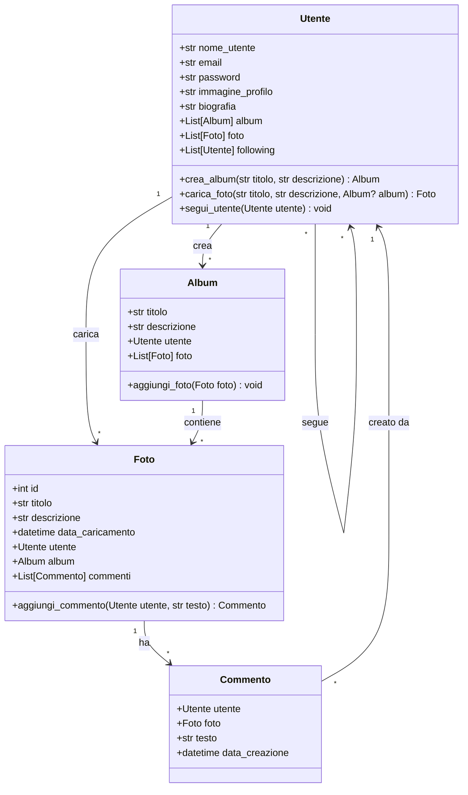

```mermaid
classDiagram
    class Utente {
        +str nome_utente
        +str email
        +str password
        +str immagine_profilo
        +str biografia
        +List[Album] album
        +List[Foto] foto
        +List[Utente] following
        +crea_album(str titolo, str descrizione) Album
        +carica_foto(str titolo, str descrizione, Album? album) Foto
        +segui_utente(Utente utente) void
    }

    class Foto {
        +int id
        +str titolo
        +str descrizione
        +datetime data_caricamento
        +Utente utente
        +Album album
        +List[Commento] commenti
        +aggiungi_commento(Utente utente, str testo) Commento
    }

    class Album {
        +str titolo
        +str descrizione
        +Utente utente
        +List[Foto] foto
        +aggiungi_foto(Foto foto) void
    }

    class Commento {
        +Utente utente
        +Foto foto
        +str testo
        +datetime data_creazione
    }

    Utente "1" --> "*" Album : crea
    Utente "1" --> "*" Foto : carica
    Utente "*" --> "*" Utente : segue
    Album "1" --> "*" Foto : contiene
    Foto "1" --> "*" Commento : ha
    Commento "*" --> "1" Utente : creato da
```
