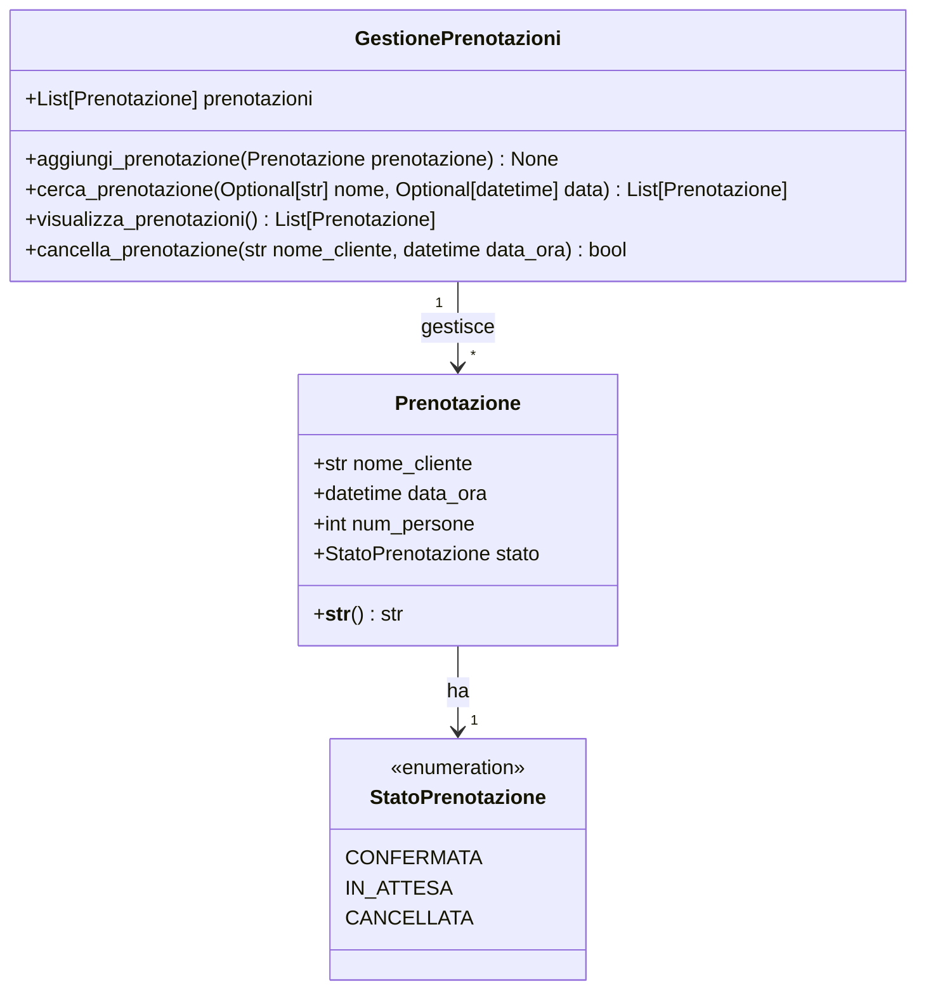

# Restaurant Booking System - Class Diagram

```mermaid
classDiagram
    class StatoPrenotazione {
        <<enumeration>>
        CONFERMATA
        IN_ATTESA
        CANCELLATA
    }

    class Prenotazione {
        +str nome_cliente
        +datetime data_ora
        +int num_persone
        +StatoPrenotazione stato
        +__str__() str
    }

    class GestionePrenotazioni {
        +List[Prenotazione] prenotazioni
        +aggiungi_prenotazione(Prenotazione prenotazione) None
        +cerca_prenotazione(Optional[str] nome, Optional[datetime] data) List[Prenotazione]
        +visualizza_prenotazioni() List[Prenotazione]
        +cancella_prenotazione(str nome_cliente, datetime data_ora) bool
    }

    GestionePrenotazioni "1" --> "*" Prenotazione : gestisce
    Prenotazione --> "1" StatoPrenotazione : ha
```
