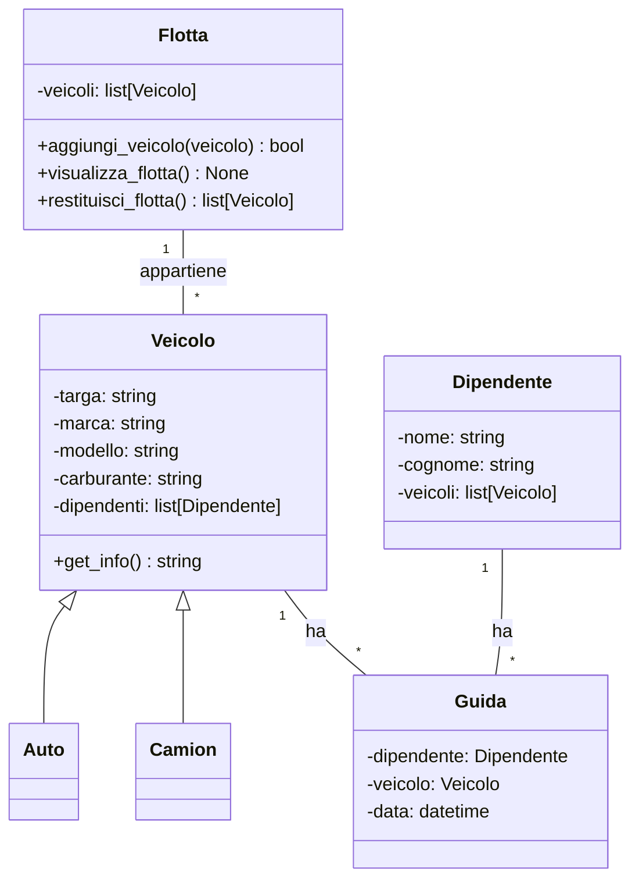

```mermaid
classDiagram
    Veicolo <|-- Auto
    Veicolo <|-- Camion
    Flotta "1" -- "*" Veicolo : appartiene
    %% Dipendente "*" -- "*" Veicolo : guida
    Dipendente "1" -- "*" Guida : ha
    Veicolo "1" -- "*" Guida : ha

    class Guida {
        -dipendente: Dipendente
        -veicolo: Veicolo
        -data: datetime
    }

    class Dipendente {
        -nome: string
        -cognome: string
        -veicoli: list[Veicolo]
    }

    class Veicolo {
        -targa: string
        -marca: string
        -modello: string
        -carburante: string
        -dipendenti: list[Dipendente]
        %% +__init__(marca, modello, carburante)
        +get_info() string
    }

    class Auto {
    }

    class Camion {
    }

    class Flotta {
        -veicoli: list[Veicolo]
        +aggiungi_veicolo(veicolo) bool
        %% print
        +visualizza_flotta() None
        %% return
        +restituisci_flotta() list[Veicolo]
    }
```