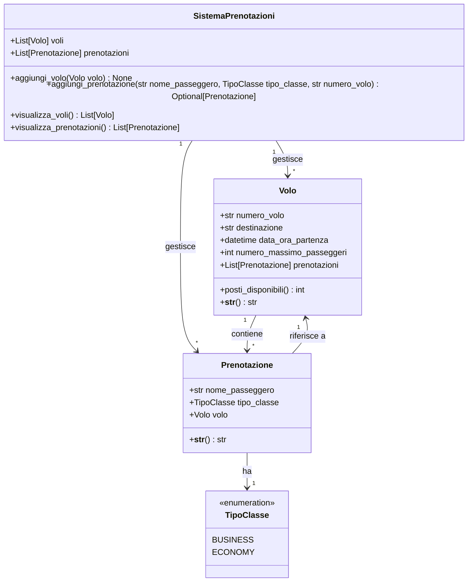

# Flight Booking System - Class Diagram

```mermaid
classDiagram
    class TipoClasse {
        <<enumeration>>
        BUSINESS
        ECONOMY
    }

    class Volo {
        +str numero_volo
        +str destinazione
        +datetime data_ora_partenza
        +int numero_massimo_passeggeri
        +List[Prenotazione] prenotazioni
        +posti_disponibili() int
        +__str__() str
    }

    class Prenotazione {
        +str nome_passeggero
        +TipoClasse tipo_classe
        +Volo volo
        +__str__() str
    }

    class SistemaPrenotazioni {
        +List[Volo] voli
        +List[Prenotazione] prenotazioni
        +aggiungi_volo(Volo volo) None
        +aggiungi_prenotazione(str nome_passeggero, TipoClasse tipo_classe, str numero_volo) Optional[Prenotazione]
        +visualizza_voli() List[Volo]
        +visualizza_prenotazioni() List[Prenotazione]
    }

    SistemaPrenotazioni "1" --> "*" Volo : gestisce
    SistemaPrenotazioni "1" --> "*" Prenotazione : gestisce
    Prenotazione --> "1" Volo : riferisce a
    Prenotazione --> "1" TipoClasse : ha
    Volo "1" --> "*" Prenotazione : contiene
```
