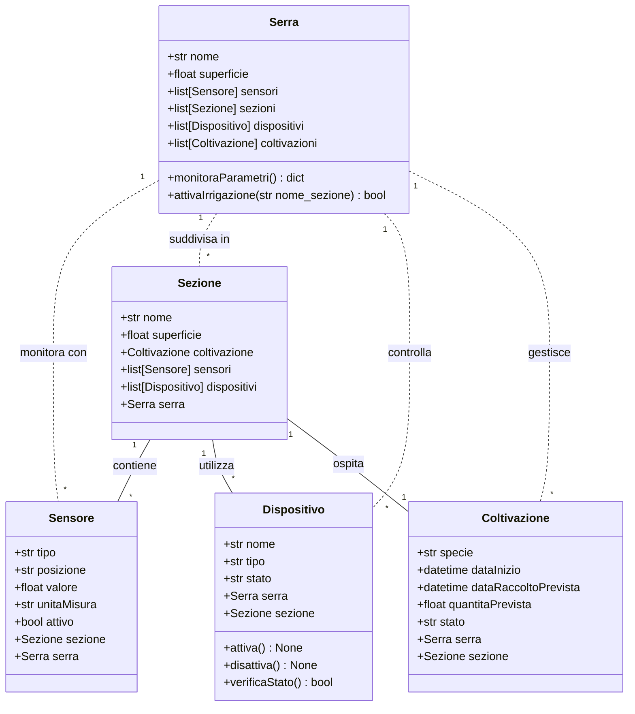

```mermaid
classDiagram
    class Serra {
        +str nome
        +float superficie
        +list[Sensore] sensori
        +list[Sezione] sezioni
        +list[Dispositivo] dispositivi
        +list[Coltivazione] coltivazioni
        +monitoraParametri() dict
        +attivaIrrigazione(str nome_sezione) bool
    }

    class Sensore {
        +str tipo
        +str posizione
        +float valore
        +str unitaMisura
        +bool attivo
        +Sezione sezione
        +Serra serra
    }

    class Sezione {
        +str nome
        +float superficie
        +Coltivazione coltivazione
        +list[Sensore] sensori
        +list[Dispositivo] dispositivi
        +Serra serra
    }

    class Dispositivo {
        +str nome
        +str tipo
        +str stato
        +Serra serra
        +Sezione sezione
        +attiva() None
        +disattiva() None
        +verificaStato() bool
    }

    class Coltivazione {
        +str specie
        +datetime dataInizio
        +datetime dataRaccoltoPrevista
        +float quantitaPrevista
        +str stato
        +Serra serra
        +Sezione sezione
    }


    Serra "1" .. "*" Sensore : monitora con
    Serra "1" .. "*" Sezione : suddivisa in
    Serra "1" .. "*" Dispositivo : controlla
    Serra "1" .. "*" Coltivazione : gestisce
    Sezione "1" -- "*" Sensore : contiene
    Sezione "1" -- "*" Dispositivo : utilizza
    Sezione "1" -- "1" Coltivazione : ospita
```
