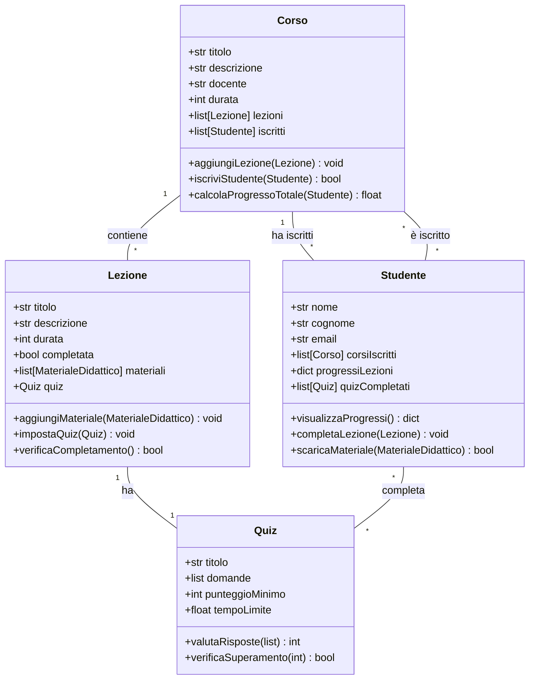

```mermaid
classDiagram
    class Corso {
        +str titolo
        +str descrizione
        +str docente
        +int durata
        +list[Lezione] lezioni
        +list[Studente] iscritti
        +aggiungiLezione(Lezione) void
        +iscriviStudente(Studente) bool
        +calcolaProgressoTotale(Studente) float
    }

    class Studente {
        +str nome
        +str cognome
        +str email
        +list[Corso] corsiIscritti
        +dict progressiLezioni
        +list[Quiz] quizCompletati
        +visualizzaProgressi() dict
        +completaLezione(Lezione) void
        +scaricaMateriale(MaterialeDidattico) bool
    }

    class Lezione {
        +str titolo
        +str descrizione
        +int durata
        +bool completata
        +list[MaterialeDidattico] materiali
        +Quiz quiz
        +aggiungiMateriale(MaterialeDidattico) void
        +impostaQuiz(Quiz) void
        +verificaCompletamento() bool
    }

    class Quiz {
        +str titolo
        +list domande
        +int punteggioMinimo
        +float tempoLimite
        +valutaRisposte(list) int
        +verificaSuperamento(int) bool
    }


    Corso "1" -- "*" Lezione : contiene
    Corso "1" -- "*" Studente : ha iscritti
    Lezione "1" -- "1" Quiz : ha
    Studente "*" -- "*" Corso : è iscritto
    Studente "*" -- "*" Quiz : completa
```
