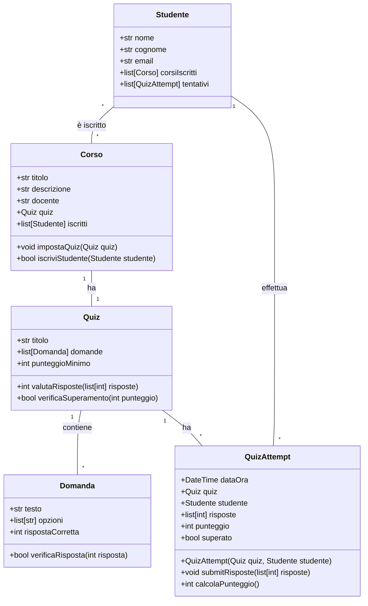

## Commento

### `Quiz.valutaRisposte(list[int]) int`

1. Riceve una lista di risposte (numeri interi)
2. Itera attraverso ogni risposta e la corrispondente domanda
3. Per ogni coppia risposta-domanda, verifica se la risposta è corretta usando `Domanda.verificaRisposta()`
4. Somma i punti per le risposte corrette
5. Restituisce il punteggio totale

### `QuizAttempt.submitRisposte(list[int]) void`

1. Memorizza la lista di risposte nell'attributo `risposte`
2. Chiama `calcolaPunteggio()` per valutare le risposte
3. Verifica se il quiz è stato superato con `quiz.verificaSuperamento(punteggio)`
4. Aggiorna l'attributo `superato`

### `QuizAttempt.calcolaPunteggio() int`

1. Passa le risposte registrate al metodo `quiz.valutaRisposte(this.risposte)`
2. Memorizza il risultato nell'attributo `punteggio`
3. Restituisce il punteggio

### `Corso.iscriviStudente(Studente) bool`

1. Verifica se lo studente è già iscritto al corso
2. Se non è iscritto, aggiunge lo studente alla lista `iscritti`
3. Aggiorna anche la lista `corsiIscritti` dello studente
4. Restituisce `true` se l'iscrizione è avvenuta con successo
