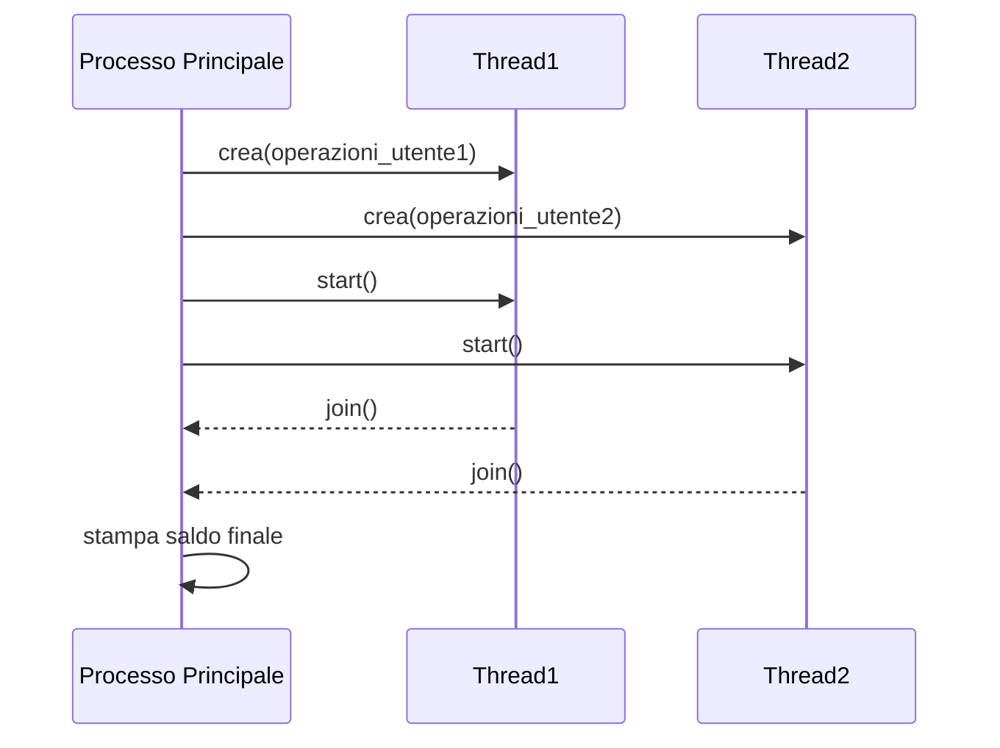

```mermaid
sequenceDiagram
    participant Main as Processo Principale
    participant Thread1
    participant Thread2

    Main->>Thread1: crea(operazioni_utente1)
    Main->>Thread2: crea(operazioni_utente2)
    Main->>Thread1: start()
    Main->>Thread2: start()

    Thread1-->>Main: join()
    Thread2-->>Main: join()
    Main->>Main: stampa saldo finale
```
